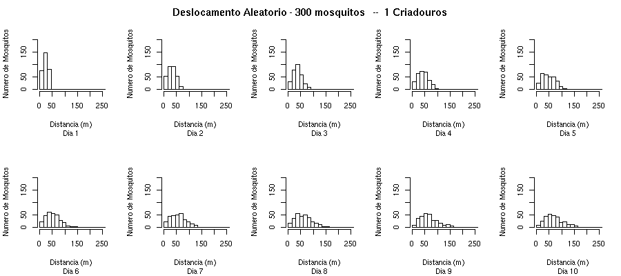
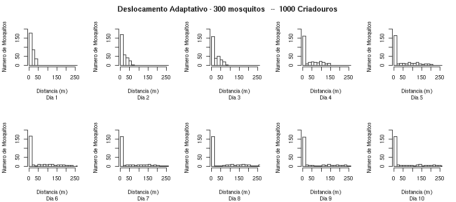

Histograms of the distance of the mosquito position from the center of the area, in each simulation day. 

300 mosquitoes moving in a complete random-walk, with 1 natural reservoir in the center of the area.

300 mosquitoes moving in an adaptative random-walk, with 1000 natural reservoirs in the center of the area.

