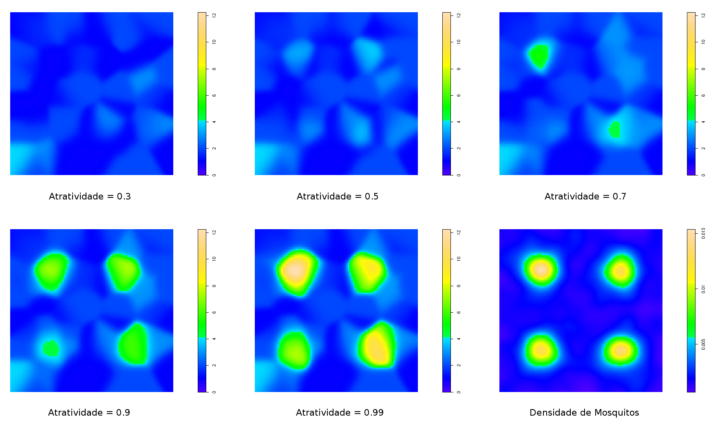

# MosqSampler
An individual-based model to simulate the process of sampling mosquitoes populations.

MosqSampler is a spatially explicit simulation model developed to evaluate the complex interplay between the availability of natural oviposition sites, the abundance of resident mosquitoes populations and the outcome of surveillance plans based on oviposition traps. It was developed as part of Arthur Silva-Lima MSc thesis in computational modeling, under the supervision of Claudia Codeço and Flavio Coelho, at the Brazilian National Laboratory for Scientific Computing (www.lncc.br)

A typical situation of epidemiological concern occurs when both mosquito populations and the availability of natural breeding sites are high. Given the high availability of natural oviposition sites, mosquito behavior choosing among traps and natural reservoirs for oviposition might introduce bias in the results of surveillance systems. These biases are hard to identify and quantify in field situations, when the actual population abundance is hardly known. MosqSampler was built and parameterized based on Aedes aegypti life history traits, but can be easily adapted to other container breeding mosquitoes. 

The model allows the evaluation of the influence of the abundance and spatial distribution of natural oviposition sites on the results of surveillance systems based on oviposition traps. It also allows the evaluation of surveillance systems based on oviposition traps with varying attractiveness to mosquitoes. 

The image below shows the effects of different traps attractiveness ('Atratividade') on the detection of the resident mosquito population ('Densidade dos Mosquitos', in the lower right panel). The ability to detect the population clusters is directly related to the attractiveness of the trap. Density plots of spatial point processes were done with spatstat (https://github.com/spatstat).

A more detailed description and R scripts for analyzing simulation outputs will be posted as publication moves on. Meanwhile, anyone interested in the model is encouraged to contact me for more details.

